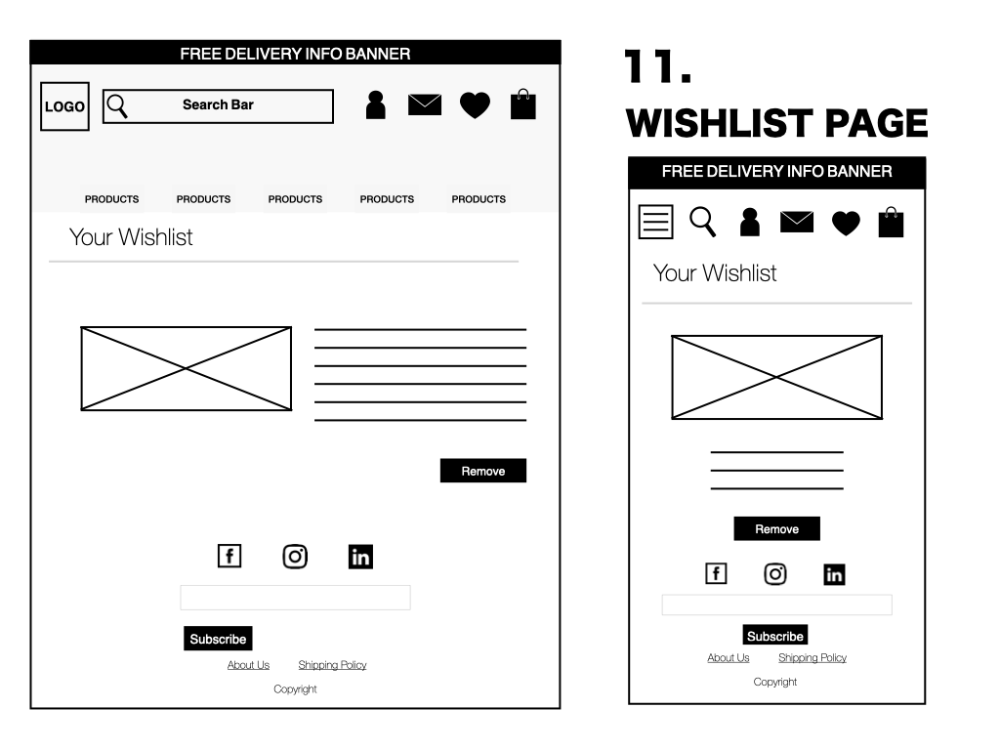
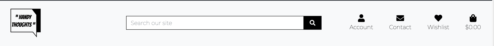
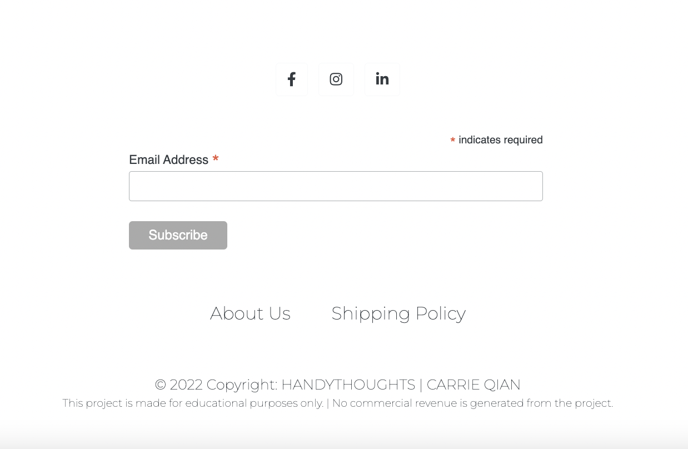
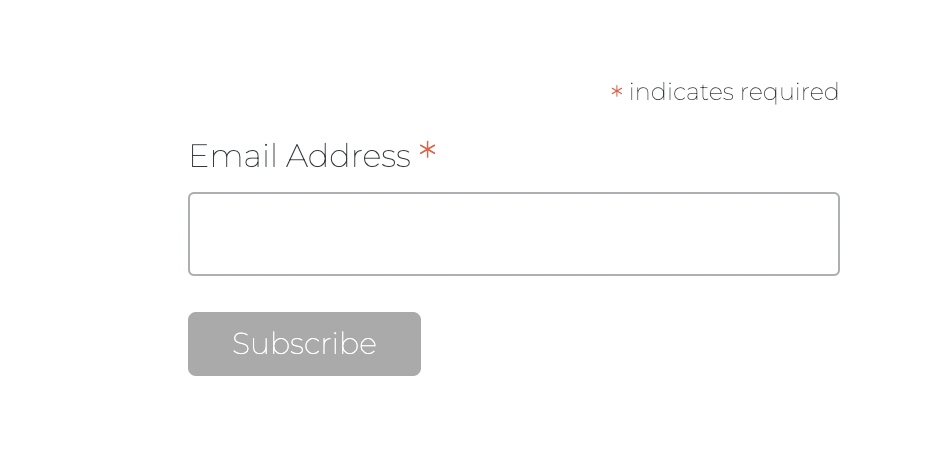

# Handy Thoughts
## Dedicated to the Journal Lovers

[The Website](https://handythoughtsshop.herokuapp.com/)

## Introduction

For centuries, people have been writing diaries, notes, and making plans, which is a therapeutic potential of reflective writing. Even though so many other forms can help us track and remember our lives, such as taking pictures, videos, or voice recording, journaling is still one of the most important ways for individuals. We want to encourage people to use this method and find their minds and themselves in this traditional way. HandyThoughts is where paper lover can find their following favorite journals.

We offer our users many choices, from economical prices to money-worth high-quality journals.

This text you see here is *actually- written in Markdown! To get a feel
for Markdown's syntax, type some text into the left window and
watch the results in the right.

## Business Plan

Have a user-friendly B2C website to boom the sales, and also bring great functional designed journals/planners to the users who need them. The B2C model makes the display and purchasing more convenient. As a niche, it already contains a wide range of users. It'd be nice to get their attention and have the sales take off.

## Goal
- Build brand awareness.
- Provide high-quality journals, both in physical products and free printable files.
- Drive sales with Newsletters, showcase the products and keep friendly contact with users.
- Excellent UX keeps potential clients on-site enough to sign up and purchase.

## UX
### Ideal Client
The ideal client for this business is:
- English speaking.
- Who has journaling, planning, doodling, and writing habits and loves to be productive and recoding life moments.

Visitors to this website are searching for:
- Gifts.
- Exploring a new way to record their life.

Why our website?
- We have a different range of categories.
- Easy to navigate.
- Showing enough information about the product the users need.
- Guiding users to the website's goal - to sign up and purchase.

## User Stories
- As a user, I can view products on the site without registering.
- As a user, I can create an account, log in, and log out.
- As a user, I can modify my profile page, change my delivery address, and view my order history on my account page.
- As a user, I can add products to my shopping cart and purchase them all at once.
- As a user, I can modify my shopping cart and add or remove products. 
- As a user, I can buy without registering a profile on the site.
- As a user, I can choose to save my delivery info to my account.
- As a user, I will receive all the confirmation of my order on my account page and by email.
- As a user, I can contact the site crew if I have requests or questions.
- As a user, I can add products to my wishlist to think about it.
- As a user, I can view my wishlist.
- As a user, I can remove products from my wishlist if I am no longer interested.
- As a user, I can write a review on the products and view them.
- As a superuser, I can add products to the site so users can purchase them.
- As a superuser, I can modify or remove products.
- As a site owner, I can use mail chimp to send promotional emails to customers.
- As a site owner, I can use newsletters to approach my customers.

## Wireframe mockups:
- Homepage

- All Products Page

- Product Detail Page

- Profile Page

- Contact Page

- Shopping Cart Page

- Checkout Page

- Checkout success page

- About Us Page

- Shipping Policy Page

- Wishlist Page


## Features
Each page features a responsive navigation bar with a conventional placing of the logo (top left), a search bar in the middle, then Account, Contact, and Shopping Cart on the right top corner, and Wishlist next to Contact if the user is login.

#### The header part of the site

- Header on big screen without wishlist (not logged-in)

- Header on big screen with wishlist (logged-in)


#### The search bar

The search bar on the header is showing on big screens. On small screens, it shrunk into an icon, when the user clicks on it, the search bar shows under. User can search keyword in the bar to find the products.

- Search bar on the big screens, showing search function 

- Search bar on the small screen shrunk into an icon

- Search bar on the small screen after click, the bar showing under the icon


#### Contact icon

Each page features contact icon.  

- Contact icon on big screen.

- Contact icon on small screen.


#### Wishlist icon

The wishlist icon only shows when the user logged in.

- Header on big screen without wishlist (not logged-in)

- Header on big screen with wishlist (logged-in)

- Wishlist icon on big screen

- Wishlist icon on small screen


#### The Shopping Cart Icon

When the user adds a product to the shopping cart icon on the right top corner, the total amount of the products will be shown on the top bar. On small screens, there won't be number showing, but the icon will turn blue means it's not empty. 

- The shopping cart icon on big screen

- The shopping cart icon on small screen

- The shopping cart icon turns blue on small screen when the cart isn't empty


#### The Free Delivery Banner

Each page features free delivery information on top to increase more purchase. 

- The banner

- Example: The banner on Profile Page

- Example: The banner on Product Page


#### The navegation head on big screens

Each page features a navigation head with Product categories. 


#### The navegation head on small screens

While on small screens, the Search Bar, Account, Wishlist if logged in, Contact, and Shopping bag will become one row of icons, with a burger menu on the left top with a dropdown menu for the navigation of the product categories.

- Header on small screen without wishlist (not logged-in) 

- Header on small screen with wishlist (logged-in)

- The burger menu on the top left


#### The Footer

Each page features a footer on the bottom, with our social media link displayed.
- The footer on the big screen

- The footer on the small screen


#### Home Page

Only the home page features a background picture (I take a picture of my journal) in the middle of the page, with a "SHOP NOW" button to navigate to the product page. It is "overlayed" on all other pages, covered in white. The purpose of the home page background picture is to grab attention and give a positive emotional response to the user.

- Homepage on big screen

- Homepage on small screen


#### All Products Page

This page lists all products on the site, and it is responsive. On the larger screen, the products list 4 in a row, in the middle to large, 3 in a row, minor to middle screen, and 2 in a row, and lastly, it lists only 1 in a row.
It shows the product's picture, name, brand, SKU, prices, and categories, and only the superuser can see two links for editing and deleting products on the page.
Users can click on a specific product to view its detail of the product.

- All Products Page on big screen

- All Products Page on small screen


#### Product Detail Page

This page shows specific product information to the user, with a product picture, price, brand, categories, and descriptions. Only the superuser can see two links for editing and deleting products on the page. The superuser can change the file if needed without operating it on the admin panel. Users can click the button on the page to add a product to the wishlist, update the quantity of the wanting product, click "add to cart," or click "keep shopping" to go back to all products and choose other products. Users can also click the "Add Review" button to add a review to the specific product.

- Product Detail Page on big screen

- Product Detail Page on small screen


#### Profile Page

This page contains user delivery information with a form, so the users can update their info by clicking the button at the bottom of the form when needed.

There is an order history listed next to the form. It shows the order number, order date, and total amount of the order. Every order number links to the specific "checkout success" page.

- Profile Page on big screen

- Profile Page on small screen


#### Contact Page
This page contains a form open to anyone visiting our shop. They can leave their email address, requests, or questions by clicking the button. 

Once the user clicks the button to send messages, if it is sent, the user will see an alert message "Successfully sent your message." Or it will show an alert message "Failed to send the request. Please ensure the form is valid." 

In the admin panel, the super user/site owner can see the content of the messages and give a response to the user. 

- Contact Page on big screen

- Contact Page on small screen


#### Shopping Cart Page

This page shows the product added to the shopping cart by the user. It displays product info of product picture, name, SKU, unit price, quantity, subtotal, shipping cost, and total amount. With the quantity of the product, the user can update and remove it by clicking the "+" and "-," "update," and "remove" buttons. And there is free shipping info below the total cost to the user. With options of "Keep shopping " and "Secure Checkout," the user can decide the next step.

If there is nothing in the shopping cart, it appears with one message" Your shopping cart is empty."

- Shopping Cart Page on big screen - with Item

- Shopping Cart Page on small screen - with Item


- Shopping Cart Page on big screen - Empty

- Shopping Cart Page on small screen - Empty


#### Checkout Page

This page has a checkout form on the left and an order summary on the right. 
The user must fill out the form to make the purchase. There are names, a shipping info form listed, a box to check whether the user would like to save this shipping info to their profile, and a payment field for the user to put in the card details to make the payment. Two buttons at the bottom provide the user with two options: adjust the shopping cart or complete the order.
The order summary shows the product picture, name, quantity, subtotal, shipping cost, and the order amount.
When the user clicks the "Complete Order" button, there will be a loading blue page covering the page with arrows turning, showing the user that the payment is in the process.

- Checkout Page on big screen

- Checkout Detail Page on small screen


#### Checkout Success Page

This page shows the information after the user makes a successful payment. Order details are shown, with product name, order number, date, and total amount. 

- Checkout Success Page on big screen

-Checkout Success Page on small screen


#### About Us Page

This page shows our users the information about "who we are." User can click on the link living in the footer.

- About Us Page on big screen

- About Us Page on small screen


#### Shipping Policy Page

This page shows the shipping policy of our website. User can click on the link living in the footer.

- Shipping Policy Page on big screen

- Shipping Policy Page on small screen


#### Register

This page is a simple bootstrap template with input fields for users to fill out information and sign up.

- Register Page on big screen

- Register Page on small screen


#### Log In

This page is a simple bootstrap template with input fields for users log in with their account information.

- Log In Page on big screen

- Log In Page on small screen


#### Sign Out

This page is a simple bootstrap template with two buttons for user to either "cancel" the log-out, or just log out.

- Sign Out Page on big screen

- Sign Out on small screen


#### Toast
This project features Toast to show the message on the top right corner when user interating with the site. It appears both on big and small screens.
Example:


## Information Architecture
### Database Modelling

#### Products App:

| Model Name | Models | Model Type |
| ------ | ------ |------ |
| Category | name  |CharField |
| Category | friendly_name |CharField |
| Product | Category |Foreign Key/User Model|
| Product | sku |CharField |
| Product |name |CharField |
| Product |price  |DecimalField |
| Product |description  |TextField |
| Product |imageURL  |URLField |
| Product |image  |ImageField |

#### Checkout App:
| Model Name | Models | Model Type |
| ------ | ------ |------ |
| Order | order_number |CharField |
| Order |user_profile    |Foreign Key/User Model |
| Order | full_name |CharField |
| Order | email  |EmailField |
| Order | phone_number  |CharField |
| Order |country  |CountryField |
| Order |postcode |CharField |
| Order |town_or_city  |CharField |
| Order |street_address1  |CharField |
| Order | street_address2 |CharField |
| Order |county  |CharField |
| Order | additional_shipping_info |TextField |
| Order |date  |DateTimeField |
| Order |delivery_cost  |DecimalField |
| Order |order_total  |DecimalField |
| Order |grand_total  |DecimalField |
| Order |original_shopping_cart  |TextField|
| Order |stripe_pid  |CharField |
| OrderLineItem |order  |ForeignKey/UserModel |
| OrderLineItem |product  |ForeignKey/UserModel |
| OrderLineItem |quantity  |IntegerField |
| OrderLineItem |lineitem_total  |DecimalField |

#### Profiles App:
| Model Name | Models | Model Type |
| ------ | ------ |------ |
| Profiles | User|OneToOneField/ UserModel |
| Profiles | street_address1  |CharField |
| Profiles | street_address2 |CharField |
| Profiles | postcode  |CharField |
| Profiles |town_or_city  |CharField |
| Profiles |country  |CountryField |
|Profiles |email  |EmailField |
| Profiles |phone_number  |CharField |
| Profiles |birthday  |DateField |

#### Review App:
| Model Name | Models | Model Type |
| ------ | ------ |------ |
| Review |product_name |Foreign Key|
| Review | user_name |CharField |
| Review |email  |EmailField |
| Review |body  |TextField |
| Review |created_on  |DateTimeField |

#### Wishlist App:
| Model Name | Models | Model Type |
| ------ | ------ |------ |
| Wishlist |user  |OneToOneField |
| Wishlist | product |ManyToManyField |
| WishlistItem |product  |ForeignKey |
| WishlistItem |wishlist  |ForeignKey|

#### Contact App:
| Model Name | Models | Model Type |
| ------ | ------ |------ |
|Contact |email  |EmailField |
| Contact | subject |CharField |
| Contact |message  |TextField |


## Existing Features
- Header Logo - It exists on every page on the larger screen. It disappears on the medium and smaller screens and mobile screens. Clicking the logo returns to the home page.
- Header navigation bar - It exists on every page on the larger screen and displays on the burger button top left on medium and smaller mobile screens.
- Footer - It exists on every page and allows all users to navigate to the site's social media accounts quickly and sign up for the newsletter. It also shows the copyright at the bottom.
- Free Shipping Banner - It exists on every page to promote more sales.
- Contact Form - It exists in the contact.html and allows the user (who doesn't have to be a login user) can send us messages if they have any requests or questions about the products or website.
- Review Form - This allows users to make reviews of the products.
- Wishlist - This allows users to add products they potentially want to buy.

## Features to Implement in future
- User Profile Picture - Users can upload their picture to the profile, which will show on the review comment when they do reviews. 
- Emoji - Users can use emojis when they leave reviews in the review area.
- FAQ page, table with FAQs, and dropdown buttons to view answers - Gives potential users easy-to-find answers to their common questions.
- "You might also like" - To suggest a similar product according to the user's taste and increase sales.
- Free Downloadable Digital Journal - For displaying the digital journal I designed. Allow users to download them for free to attract users to come back to the site to have potential purchases. 

## SEO Implementation
I have used the following meta to implement my SEO words:
 ```sh
<meta name="description" content="Handy Thoughts, provide great journals to paper lovers">
```
 ```sh
 <meta name="keywords" content="journals, planners, bullet, diary, notebook, stationery, paper, stationery shop">
```
#### Sitemap:
The Sitemap.xml file is stored in the project level directory.
[HandyThoughts Sitemap in Github](https://github.com/Carrie8348/handy-thoughts/blob/main/sitemap.xml)

#### Robots.txt
The Robots.txt file is stored in the project level directory.
[HandyThoughts Robots.txt in Github](https://github.com/Carrie8348/handy-thoughts/blob/main/robots.txt)


## Marketing

#### Facebook Page

For marketing purposes, creating a Facebook Page is very important for business owners nowadays. To expose our product and future campaigns on FB is the best place. With such a significant volume of a user, starting a very niche page and attracting journal lovers could be easier than any other platform. 
Here below are the screen captures of the FB page.

- The profile picture on fb page


- The fb page screen capture

- The fb page first post

- The fb page close up

- The fb page is not yet published according to the instruction from the Web Marketing course


#### Instagram
Another great platform is Instagram. Facebook is for the first generation of internet users, and Instagram targets younger generations. So far, there is an Instagram icon on the page's footer, but not linking to anything. In the future, hopefully, we will create an account and showcase our products to millions of potential customers out there.

#### Linked-In
There is a link to my linked-in account URL for business growth potential. For people interested in this business, or potential suppliers, it is an authentic platform to build up open and honest business possibilities. 

#### Newsletter
On the footer, there is a sign-up form embedded from Mailchimp. It is an excellent tool for the site owner to create a campaign by sending news to the customer's email address collected from this form.



## Bugs
- Wishlist Error: My biggest issue was when I tried to create a wishlist app. I had a blurry idea thinking it was more like a "shopping cart" function, but somehow, I wasn't clear about whether the user has an OneToOne relationship. I added an AUTH.USER.Model, which I set in the Products model. That worked for that time, but when I tried to deploy the project on Heroku, it threw an error about it violating the M2M rules. 
- Solution: After talking to my mentor Harry Dhillon, he walked me through the idea of a wishlist and showed me the logic of it. In the end, I added a new app called "wishlist" and put the models in there, and it worked out fine.


- Wishlist Migration Error: The Wishlist app was added after the project got deployed on Heroku. After I added the model, I couldn't make migrations. Threw errors and complaints there was no secret key.
- Solution: Tutor Alan told me I didn't put the secret keys in the local environment, even though they are on Heroku. Therefore, I created an env.py in the directory and added all related keys. It worked out fine then. 

- The Mailchimp newsletter box is not responsive on mobile phones: After I put the newsletter in the footer area, I found that it doesn't become smaller on a mobile screen. 
- Solution: After many tries on different flex settings or adding a CSS file, the ultimate problem was it wasn't included in the media queries area.


- Some common mistakes here and there: I followed along with the boutique ado project to create my project. Therefore not so many bugs come up, only when I was making my models, those more often bug me. But the most common ones are always "forget to add  or typos. 
- Solutions: Through this journey, I am a changed student, from someone who always starts a tutor session and can't understand the error messages (even though I know every word in the sentence, but putting them together was devastating) to someone who can calmly be looking at the error message, either spot the problems myself or google it, eventually fix it. Or even I start a tutor session, I still know how to ask the question or look at the answers without feeling useless and feel dumb when the tutor asks me questions. I find it is always challenging through time, but this course has taught me a lot, and I stopped being paranoid about the errors. I have built up my confidence as a developer.

## Used
- This project uses HTML and CSS programming languages.
- Bootstrap
- Django: 
--- The project uses Django MTV (models, templates, and views) to make front-end and back-end functions with each other.
--- The project uses Bootstrap 4 to structure the website and make the website responsive quickly and simply.
--- The project also uses BootstrapCDN to provide icons from FontAwesome.
- Google Fonts : The project uses Google Fonts to style the website fonts.
- jQuery: The project uses jQuery to reference Javascript needed for the responsive navbar.
- Crispy Forms: It is for the forms to interact with the database.
- Stripe: To make payment succeeded.
- AWS Storage: AWS storage is used to store static and media files.
- Git: To commit to our GitPod terminal and push to GitHub.
- GitHub: To keep the project after pushing.
- Heroku: To deploy the project.
- Keynote: Design my logo, draw my wireframes

## Testing
Testing information can be found in separate TESTING—MD file.
[The Testing.md File is here](https://github.com/Carrie8348/handy-thoughts/blob/main/documentations/pdfs/Manual%20Testing%20doc.pdf)

## Deployment
#### Heroku
This project deploys on Heroku.
- Add requirements.txt by using the command in the terminal:
 ```sh
pip3 freeze --local > requirements.txt
```
- Git adds and commits the changes.
- Create or log in to a Heroku account.
- Create a Heroku app.
- On the Resources page, search and add Heroku Postgres.
- On the Resources page, search and add Heroku Postgres.
--- Database URL
--- Secret_key
-Since I manually add products from the admin panel, to load it up to Heroku, I need to use this command to turn it into a JSON file: 
```sh
python3 manage.py dumpdata -a products -o products.json
```
- After the products are temporarily "dumped," I connect to Postgres from my settings.py, then use this command to load up the products:
```sh
python3 manage.py loaddata products.json
```
- Add gunicorn to the project.
- Allow Heroku as ALLOWED_HOSTS in the settings of the project.
Add and commit the changes to the code and push them to Github.
- Deploy page in Heroku, choose "GitHub" as the "deployment method, " connect to GitHub, and select related repo. 
- Choose "Automatic Deploys"
- Choose "Enable automatic deploys" or choose "Deploy branch" and manually deploy
- Click "Deploy branch."
- If successful, it shows a message "The app was successfully deployed".
- "View" when it is done.

## Local Environment
- Use Gitpod's built-in virtual environment feature.
- Create env.py contains the duplicate keys that exist in the Heroku Config vars:
---AWS Access Key ID
---AWS Secret Access Key
---Database URL
---Email Host Pass
---Email Host User
---Secret Key
---Stripe Public Key
---Stripe Secret Key
---Use Aws
-To also start a requirement.txt file with the command :
```sh
pip3 install -r requirements.txt
```

## Stripe
#### Stripe Secret Key & Stripe Public Key
- Get a stripe account.
- Log in and choose the developers tab.
- Get API keys in the left side menu. 
- Click on both STRIPE_PUBLIC_KEY and STRIPE_SECRET_KEY.

#### Stripe WH Secret Key
- Add Endpoint by clicking the button. 
- Add all events. 
- On the webhooks page, reveal the sign-in secret keys and copy them.
- Paste it in the Settings and Heroku
- Call it "STRIPE_WH_SECRET" variable

#### Email Variables
- I am using Gmail to achieve this, as the course shows.
- Log into  Gmail account.
- In Settings, choose account and import.
- Choose "other google account settings."
- Choose "Security"
- Turn on two-step verification, follow the instruction to add a phone number, and get it verified.
- Go back to security App passwords - choose mail, device, choose other, type in the name "Django," and copy the app password.
- Put the code in Heroku config var. The EMAIL_HOST_USER is the Gmail address.

## AWS Bucket
- Register on Amazon Web Services.
- In the dashboard, use the search bar to search S3.
---Open it and Create a bucket.
---Set the name for the bucket (better match the project name)
---Enable ACL, Bucket owner preferred.
---Block Public Access, set it  "Allow public success."
---Click "Create Bucket"
---In the created bucket, find properties, set Static Website Hosting, enable it, and fill in document index.html and error.html.
---In the permissions tab, copy the CORS provided in the course, paste it to this CORS tab, and save it.
---Generate Bucket Policy - Follow the instruction from the course. 
---Access control list edit: For public access and check the list box and save.
-In the dashboard, use the search bar to search IAM.
---Create user groups
---Create Policy.
---Click import managed policy.
---Copy ARN and paste it into Resource. Add list with two elements has "ARN" in it ["arn:...", "arn:...,/*]. 
---Click the "Add" button, then "Create Policy."
---Attach policy to the group.
---Create a User to go into the group.
---Set User name.
---Add user to the group created earlier.
---Download .csv file.
- Connect Django to the AWS S3 bucket
---Install boto3:pip3 install boto3
---Install django-storages:pip3 install django-storages
--- Freeze to requirements.txt:pip3 freeze > requirements.txt
---Add Storages to Project's settings.py, in the INSTALLED_APPS.

#### The Bucket Config
```sh
AWS_STORAGE_BUCKET_NAME = os.getenv('AWS_STORAGE_BUCKET_NAME')
AWS_S3_REGION_NAME = 'eu-north-1'
AWS_ACCESS_KEY_ID = os.getenv('AWS_ACCESS_KEY_ID')
AWS_SECRET_ACCESS_KEY = os.getenv('AWS_SECRET_ACCESS_KEY')
AWS_S3_CUSTOM_DOMAIN = f'{AWS_STORAGE_BUCKET_NAME}.s3.amazonaws.com'

```
- Set environmental variables in Heroku
---Open the CSV file and copy the value, and put it into Heroku settings
---remove DISABLE_COLLECTSTATIC variable from Heroku
```sh
AWS_STORAGE_BUCKET_NAME
AWS_ACCESS_KEY_ID from csv
AWS_SECRET_ACCESS_KEY from csv
USE_AWS = True
```
- Create custome_storages.py
```sh
from django. conf import settings 
from storages.backends.s3boto3 import S3Boto3Storage
class StaticStorage(S3Boto3Storage): location = settings.STATICFILES_LOCATION
class MediaStorage(S3Boto3Storage): location = settings.MEDIAFILES_LOCATION
```
- Go to settings.py , add the AWS Settings
- load media files to the S3 bucket
---Create folder "media" on the S3 bucket page.
---Upload all the photos to the media folder

Static and Media Files
```sh
STATIC_URL = f'https://{AWS_S3_CUSTOM_DOMAIN}/{STATICFILES_LOCATION}/'
MEDIA_URL = f'https://{AWS_S3_CUSTOM_DOMAIN}/{MEDIAFILES_LOCATION}/'
```

## Disclaimer
The content of this website is for educational purposes only.

## Special Thanks
I cannot believe I am writing this because my project deployed successfully.

I have to thank my mentor, Ronan McClelland, especially! He encourages me and suggests helpful documents, samples, and books. The books he recommended brought me to another level of understanding of Django better. I felt like another person. I built up much confidence in programming since I am grateful for his help. Without his encouragement and patience, I don't know if I can pull this off.

I have to thank another mentor Harry Dhillon. While I couldn't book with Ronan because his schedule was full, Harry accepted my request and had a meeting with me. He helped me with the wishlist app I wanted to create in the process but had so many problems early on. I almost gave up on it until he showed me the logic and ideas. It turned out I didn't figure out the OneToOne field in my origin model, which caused lots of problems. And it set my project done after that meeting. Very very thankful for that!

And then I must thank all the tutors, Ger Tobin, Christine Kelley, and Kevin Loughrey. You guys rock! You guys have been a great support to help me spot the bugs, explain the reasons, and show me patience, never look down on me when I am clueless. 

And to my friend Karin Oldbring, my friend, helped me through lots of emotional rollercoasters during the journey. She also inspired me to want to be better! She is a genius and has excellent front-end taste. We click almost immediately, and I can't appreciate her friendship more.


