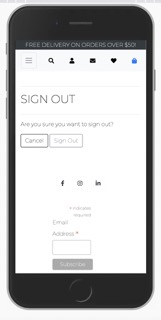
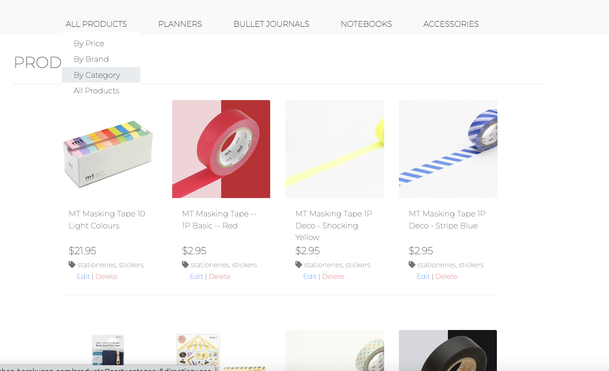
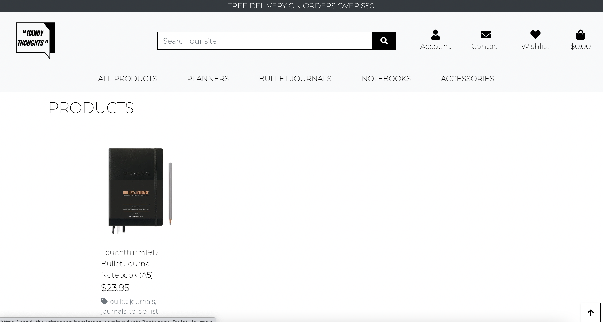
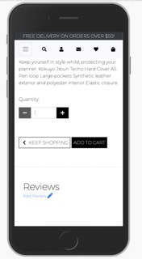
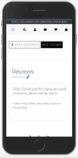
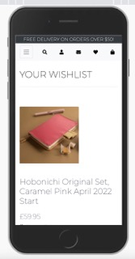

# Testing.md

[README FILE](/README.md)

[LIVE SITE](https://handythoughtsshop.herokuapp.com/)

## Contents
 - [Test User Stories](#Test-User-Stories) 
 - [Manual Testing](#Manual-Testing)  
 - [Validations](#Validations)
 - [Lighthouse](#Lighthouse-Validation) 
 - [Browser Validation](#Browser-Validation)  
 - [User Testing](#User-Testing) 

## Test User Stories
######  As a user, I can view products on the site without registering.
- All website users can view the products on the side without registering themselves. They can use the search bar to look for the product. They can click the product detail page and see the product picture, description, and price. 
###### As a user, I can create an account, log in, and log out.
- Users can click the Account Button on the top nav bar and get redirected to the page where they can register an account. When they fill out the form and click the "sign up" button,  and if the information is validated, they will receive an email with a link to confirm their understanding. When they confirm the email address, they can use the account information to log into the website. When they want to log out of the site, they can click the same button on the top nav and choose "sign out."
###### As a user, I can modify my profile page, change my delivery address, and view my order history on my account page.
- The user log can click the button on the top nav "Account" and choose "My Profile" in the dropdown menu. They will be redirected to the "profile" page, which contains their shipping information as a form. They can update the information in the form and click the button at the bottom. There is also their order history showing on the right side. There are order numbers,  product names, and total purchase prices listed. Every order number is clickable, which will redirect the user to the page when the order is made. It helps the user to see the product detail page easily.
###### As a user, I can add products to my shopping cart and purchase them all at once.
-Users with or without logging in can all add the product to the shopping cart by clicking the button on the product detail page. And a toast message box appears on the top right, showing the information of the product they added to the shopping cart. And there is a fast checkout button on the toast message box. Users can continue shopping and go to the shopping cart page to complete the payment.
###### As a user, I can modify my shopping cart and add or remove products.
- Users with or without logging in can change the quantity or remove the product from the shopping cart on the shopping cart page once they have added products to their shopping cart.
###### As a user, I can buy without registering a profile on the site.
- The user with no account on the website can check out on the checkout page and doesn't have to create an account.
###### As a user, I can choose to save my delivery info to my account.
- Users on the checkout page can tick the box to save the delivery info to their existing account. They can go to their profile page and see their address existing there.
###### As a user, I will receive all the confirmation of my order on my profile page and by email.
- Users will receive an email with the order confirmation when the purchase is successfully made. And also, see the order history on the profile page.
###### As a user, I can contact the site crew if I have requests or questions.
- Users can click the Contact button on the top nav, with or without logging in. A form will include the contact person's email address, subject, message box, and a button to send the message.
###### As a user, I can add products to my wishlist to think about it.
- The logging user can view a product detail page and click the "Add to wishlist" link to save it for the moment. 
###### As a user, I can view my wishlist.
- There will be a wishlist button that shows up on the top nav bar. Users can click that button and view what's in the wishlist, or there could be nothing in there, with a message clarifying it to the user.
###### As a user, I can remove products from my wishlist if I am no longer interested.
- The login user can go to the wishlist page and remove the saved product from it.
###### As a user, I can write a review on the products and view them.
-The login user can view the product detail page and click on the "Write a Review" below the product information. They will be redirected to the "add review" page and then click the button when the review is written. When the review is sent, on this specific product detail page, the review will be shown below the Write a Review URL.
###### As a superuser, I can add products to the site so users can purchase them.
- Super users can log in from the admin panel or the front-end to add products to the site. 
###### As a superuser, I can modify or remove products.
- Super users can log in from the admin panel or the front-end to edit or remove products to the site.
###### As a site owner, I can use mail chimp to send promotional emails to customers.
- There is a sign-up form on the footer of the website. Users can leave their email address in that box and send it to the site owner's Mailchimp account. 
###### As a site owner, I can use newsletters to approach my customers.
- After users leave their email address in the Mailchimp sign-up box,  the site owner can have them plan new campaigns by sending emails to these users.

### Manual Testing

Have a user-friendly B2C website to boom the sales, and also bring great functional designed journals/planners to the users who need them. The B2C model makes the display and purchasing more convenient. As a niche, it already contains a wide range of users. It’d be nice to get their attention and have the sales take off.

#### Header

#### Header Navigation

•	Expectation: Display on every page. On a smaller screen, the icon and the other options will be toggled in a burger button on the left top.
•	Test: Visit every page on different sizes of screens.
•	Result: Worked as expected.

Navbar – not log in - without wishlist icon

Navbar – log in - with wishlist icon

Navbar – Small Screen not log in - without wishlist icon

Navbar – Small Screen log in - with wishlist icon

#### Logo

•	Expectation: When the user clicks the logo, they will be redirected to the homepage. But it disappears on the small screen. The option is replaced by the “home” tab on the top left burger menu.
•	Test: Try every page on the big screen. When I click on the logo, the page gets redirected to the home page. I also tried the top left burger menu on the mobile screen with the “home” tab.
•	Result:Worked as expected.

The Logo:

Example: Logo on Profile page:

Example: Logo on Product page:

 
#### Free Delivery Banner

•	Expectation: It appears on every page to push sales.
•	Test: Try on both big and small screens and every page.
•	Result:Worked as expected.

The banner:

Example: Banner on Profile page:

Example: Banner on Product page:

#### Search Bar

•	Expectation: On the big screen, the search bar shows at the top of the page. Users can type keywords in it and search. On small screens, the search bar will be shrunk into an icon. When the user clicks it, the search bar shows.
•	Test:Try on both big and small screens.
•	Result:Worked as expected. 

Search Bar on Big Screen:

Search Bar on Small Screen:

Search Bar on Small Screen when click, with search bar showing under:

Example: Search Midori Products on the site:

#### Account Icon

•	Expectation: This icon shows on every page. On big screens, it shows with text under it says “Accounts,” but no text on smaller screens. It is a dropdown menu. When the user clicks this icon, there are options for login user to view their profile and log out. For not login users, there are options for logging in and registering. The users will be redirected to the pages according to what they clicked on in the menu. There is also a “Product Management” option in the menu for superusers only.
•	Test:Try on both big and small screens, log in or not log in.
•	Result:Worked as expected.

Account Icon on Big Screen:

Account Icon on Small Screen:

Account Icon – Dropdown menu without login:

Account Icon – Dropdown menu superuser login:

Account Icon – Dropdown menu normal user login:

#### Contact Icon

•	Expectation: This icon shows on every page. It is linked to the contact page. Any user on the site can see it. Like the Account icon, there is a text under the icon it says “Contact” on the big screen, not on small screens.
•	Test:Try on both big and small screens, log in or not log in.
•	Result:Worked as expected.

Contact Icon on Big Screen:

Contact Icon on small Screen:

#### Wishlist Icon

•	Expectation: This icon shows on every page only if the user is logged in. It is linked to the wishlist page. ALike the Account icon, there is a text under the icon it says “Wishlist” on the big screen, not on small screens.
•	Test:Try on both big and small screens, log in or not log in.
•	Result:Worked as expected.

Wishlist Icon on Big Screen:

Wishlist Icon on Small Screen:

 
#### Shopping Cart Icon

•	Expectation: This icon shows on every page. It is linked to the user’s shopping cart page. Like the Account icon, there is text under the icon indicating the current total in the shopping cart. If there is no product in the cart, it shows “$0.00” on the big screen, not on small screens. So to let users know that there is something in the shopping cart, the cart icon will turn blue on the small screens.
•	Test:Try on both big and small screens.
•	Result:Worked as expected.

Shopping cart Icon on Big Screen:

Shopping cart Icon on Small Screen:

Shopping cart Icon turn blue on Small Screen when there is product in it:

 
#### Main Nav

•	Expectation: The nav breaks into four parts under the header on the big screen. They separated the products into different categories, and the first “All Products” dropdown menu contains options for users to view items by category, brand, and price. On small screens, these options are in the top left burger button.
•	Test:Try on both big and small screens.
•	Result:Worked as expected.

Main Nav on Big Screen:

Main Nav folded in to burger menu on Small Screen:

 
#### Homepage Body

•	Expectation:A background picture is on the center of the screen, with a button “Shop Now,” which links to the product page.
•	Test:Try on both big and small screens.
•	Result:Worked as expected.

Homepage Body on Big Screen:

Homepage Body on Small Screen:

 
#### Footer

•	Expectation:It shows on every page. Stick to the bottom. There are three social account icons listed on top of the footer. Users can click on them and be redirected to those pages. Next is the newsletter input field connected to the site owner’s MailChimp account. The owner will have the information whenever users send their email address from that box. Under the newsletter are two links, “About Us” and “Shipping Policy,” which contain information about the online store. The very last part is the copyright.
•	Test: Try on both big and small screens and every page.
•	Result:Worked as expected.

Footer on Big Screen:

Footer on Small Screen:

#### Log In

•	Expectation:The user can click on the account icon on the top and choose “log in” from the dropdown menu. They will be redirected to the page. If the user has never signed up before, they can click the link on the text to be linked to a register page. If they already have an account, they can enter their username and password, then log in. There is also a link to reset the password if they forget it.
•	Test: Try on both big and small screens.
•	Result:Worked as expected.

Log in Page on Big Screen:

Log in Page on Small Screen:

 
#### Sign Out

•	Expectation:A login user can click on the account icon on the top and choose “sign out” from the dropdown menu. Then they will be redirected to the page with two buttons, “Cancel” and “Sign Out.” If they cancel, the user won’t be signed out, or they are just redirected to the home page without logging in.
•	Test: Try on both big and small screens.
•	Result:Worked as expected.

Sign Out Page on Big Screen:

Sign Out Page on Small Screen:

#### Register

•	Expectation:The user can click the account icon on the top and choose “register” from the dropdown menu. They will be redirected to a page with sign-up forms. They must fill out their email address, user name, password, etc. Then they can click the button at the bottom or choose the login button to log in if they have an account.
•	Test: Try on both big and small screens.
•	Result:Worked as expected.

Register Page on Big Screen:

 
Register Page on Small Screen:

#### Product

#### All Products Page
•	Expectation:When users click on the All Product tab on the top nav or the “Shop Now” button on the background picture on the home page, they will be redirected to this page, which contains all products on the page, with a product image, name, category, friendly name. Users can click on any pictures to be redirected to the specific product detail page. And there are also “edit” and “delete” options showing but only for the superuser.
•	Test: Try on both big and small screens.
•	Result:Worked as expected.

All Products Page on big screen:

All Products Page on Different Smaller Screens:

 

#### All Products Page - By price
•	Expectation:When the user clicks that option, the products will be filtered by price, displaying products from the cheapest product to the most expensive product. Users can click on any pictures to be redirected to the specific product detail page. There are product images, names, categories, and friendly names. And there are also “edit” and “delete” options showing but only for the superuser.
•	Test: Try on both big and small screens.
•	Result:Worked as expected.

All Products Page – By Price on Big Screen:

All Products Page – By Price on Small Screen:

#### All Products Page - By Brand

•	Expectation:When the user clicks that option, the products will be filtered by brand, displaying products using the alphabet descending order. Users can click on any pictures to be redirected to the specific product detail page. There are product images, names, categories, and friendly names. And there are also “edit” and “delete” options showing but only for the superuser.
•	Test: Try on both big and small screens.
•	Result:Worked as expected.

All Products Page – By Brand on Big Screen:

All Products Page – By Brand on Small Screen:

#### All Products Page - By Category

•	Expectation:When the user clicks that option, the products will be filtered by price, displaying products using the alphabet in ascending order. There are product images(or no-image image if there is no product image), names, categories, and friendly names. Users can click on any pictures to be redirected to the specific product detail page. And there are also “edit” and “delete” options showing but only for the superuser.
•	Test: Try on both big and small screens.
•	Result:Worked as expected.

All Products Page – By Category on Big Screen:

All Products Page – By Category on Small Screen:

#### Planners

•	Expectation:Only products in this Planners category will be displayed on the page when the user clicks that option. There are product images(or no-image image if there is no product image), names, categories, and friendly names. Users can click on any pictures to be redirected to the specific product detail page. And there are also “edit” and “delete” options showing but only for the superuser.
•	Test: Try on both big and small screens.
•	Result:Worked as expected.

Planners Page on Big Screen:

Planners Page on Small Screen:

#### Bullet Journals

•	Expectation:Only products in this Bullet Journals category will be displayed on the page when the user clicks that option. There are product images(or no-image image if there is no product image), names, categories, and friendly names. Users can click on any pictures to be redirected to the specific product detail page. And there are also “edit” and “delete” options showing but only for the superuser.
•	Test: Try on both big and small screens.
•	Result:Worked as expected.

Bullet Journals on Big Screen:

Bullet Journals on Small Screen:

 
#### Notebooks

•	Expectation:Only products in this Notebooks category will be displayed on the page when the user clicks that option. There are product images(or no-image image if there is no product image), names, categories, and friendly names. Users can click on any pictures to be redirected to the specific product detail page. And there are also “edit” and “delete” options showing but only for the superuser.
•	Test: Try on both big and small screens.
•	Result:Worked as expected.

Notebooks on Big Screen:

Notebooks on Small Screen:

 
#### Accessories

•	Expectation:Only products in this Accessories category will be displayed on the page when the user clicks that option. There are product images(or no-image image if there is no product image), names, categories, and friendly names. Users can click on any pictures to be redirected to the specific product detail page. And there are also “edit” and “delete” options showing but only for the superuser.
•	Test: Try on both big and small screens.
•	Result:Worked as expected.

Accessories on Big Screen:

Accessories on Small Screen:

 
#### Product Detail Page

•	Expectation:When a user views a product detail page, there will be an image of the product on the left side or a No Image pic if there’s no image. On the right side, there are product name, price, an option of “Add to Wishlist” for login user, and “edit”/“delete” options for superuser, product description. Below is the quantity box for the user to minus or add quantity. Then the following line is two buttons, “Keep shopping” and “Add to cart.” Then there is a horizontal line that keeps the review part in the lower section of the page. With the button “Write a review,” the login user can be redirected to the add review page. For not login users, they will be redirected to the login page. If there are any reviews of the product, they will be shown in this section too.
•	Test: Try on both big and small screens.
•	Result:Worked as expected.

Product Detail Page on Big Screen:

Product Detail Page on Small Screen:

#### Product Review Page

•	Expectation:Login users can write a product review by clicking the product detail page button. They will be redirected to this write review page and then leave their comments by clicking the button at the bottom. When the review is added to this product detail page, it will be shown under the product information. And the user can also edit or remove the comment by clicking on the links. The user can revise and re-send the review on the edit review page.
•	Test: Try on both big and small screens.
•	Result:Worked as expected.

Product Review Button on Big Screen:

Product Review Button on Small Screen:

Product Review Display in Product Detail Page on Big Screen:

Product Review Display in Product Detail Page on Small Screen:

Add Review Page on Big Screen:

Add Review Page on Small Screen:

Edit Review Page on Big Screen:

Edit Review Page on Small Screen:

#### Contact Page
•	Expectation:When the user clicks the contact icon on the navbar, they will be redirected to this page. The form contains three input fields: Email, Subject, and Message. Below that is a button, “Send a message.” When the user fills up the paper and sends the message, the superuser can see the message from the admin panel.
•	Test: Try on both big and small screens and every page.
•	Result:Worked as expected.

Contact Page on Big Screen:

Contact Page on Small Screen:

 
#### Wishlist Page
•	Expectation: Only login users can see this icon on the navbar and be redirected to this page. If there are added products, it will show the wishlist item with a product picture (or no-image image if this product has no picture), product name, price, and friendly name. Then there is a button “Remove from wishlist” under these for the user to remove the item if they’re no longer interested. If there is nothing on the wishlist, a message will show “Your wishlist is empty.”
•	Test: Try on both big and small screens and every page.
•	Result:Worked as expected.

Wishlist Page Empty on Big Screen:

Wishlist Page Empty on Small Screen:

Wishlist with Item on Big Screen:

Wishlist with Item on Small Screen:

 
#### Shopping cart Page

•	Expectation: All users can tap into this page by clicking the top nav shopping cart icon. If there is nothing in the shopping cart yet, a message will show “Your shopping cart is empty,” then a button under “keep shopping” redirects users to the product page. If there are items in the shopping cart, then the added item’s picture (or no-image image if the product has no picture), product name, SKU, unit price, and the quantity box for the user to update the quantity and subtotal showing. The product name and pictures are clickable, redirecting to this product’s detail page. Then there are subtotal and shipping costs listed, which come with the total in a bigger font. If the total price is not in the free-shipping range, there is a line of text reminding the user and encouraging them to buy more. Lastly are two buttons, “Keep Shopping” and “Secure Checkout.” Either redirect the user to the product page again for more shopping or direct the user to the checkout page.
•	Test: Try on both big and small screens.
•	Result:Worked as expected.

Shopping Cart Empty on Big Screen:

Shopping Cart Empty on Small Screen:

Shopping Cart with Item on Big Screen:

Shopping Cart with Item on Small Screen:

#### Checkout Page
•	Expectation: When users are on this page, there will have a form on the left side for them to fill out their shipping information, card information, and two buttons: “Adjust Shopping Cart” and “Complete Order.” On the right side is the product info, including a smaller product image (or no-image image if the product has no picture), product name, quantity, price, and subtotal and total. A line with a box can be ticked before the card field, so the user who wants to save their profile can tick on it.
•	Test: Try on both big and small screens.
•	Result:Worked as expected.

Checkout Page on Big Screen:

Checkout Page on Small Screen:

 
#### Checkout Success Page

•	Expectation: When the user completes the order, they will be redirected to this page. There is a “Thank you” at the top of the page, then the order detail in the center. Below the order information is a button for the user to return to the product page.
•	Test: Try on both big and small screens.
•	Result:Worked as expected.

Checkout Success Page on Big Screen:

Checkout Success Page on Small Screen:

#### Profile Page

•	Expectation: When the login user clicks the account icon on the header and chooses “My Profile,” they will be redirected to this page. There will be a delivery info form on the left for users to update the delivery info if they need to. And on the right side, there are the order histories listed. Order numbers, order date, product names, and total are included. The order number is clickable. It links to the previous checkout success page. On small screens, the delivery info form will be on the top, and the order history will be under the form. The user can scroll down.
•	Test: Try on both big and small screens.
•	Result:Worked as expected.

Profile Page on Big Screen:

Profile Page on Small Screen:

 
#### Product Management Page

•	Expectation: The superuser can click on the account icon on the header nav. In the dropdown menu, choose this option. Superusers can add products from here without logging into the admin panel. They can fill in the information and pictures of the product and click the button at the bottom. On small screens works the same.
•	Test: Try on both big and small screens.
•	Result:Worked as expected.

Product Management Page on Big Screen:

Product Management Page on Small Screen:

#### Product Management – Product Edit Page

•	Expectation: The superuser can click on the link in the product detail page to be redirected to this page, and edit the product without logging into the admin panel. They can fill in the information and pictures of the product and click the button at the bottom. On small screens works the same.
•	Test: Try on both big and small screens.
•	Result:Worked as expected.

Product Management – Edit Product Page on Big Screen:

Product Management – Edit Product Page on Small Screen:

  
## Validations

#### HTML
- The W3C Markup Validator service was used to validate the HTML.
- All HTML pages are tested and passed with no errors.

#### CSS
- The W3C Markup Validator service was used to validate the CSS.
- All CSS files are tested and passed with no errors.

#### Python
- The PEP8 Python validator service was used to validate the python files.
- In the testing, the main errors are because lines are too long. I tried to make them shorter, but it passed the test but did not function right on the site anymore. Therefore I put #noqa at the end of the lines.

#### JavaScript
- I used https://jshint.com/ to test the JavaScript. The error appears, claims undefined variable "Stripe," but since this code was copied from Boutique Ado, and it is too vital for the site to work, I ignored it for the moment.

## Lighthouse Validation
The site has use dev tool's Lighthouse Validation:

## Browser Validation
The site was tested on different browsers:
- Google Chrome
- Firefox
- Safari

## User Testing
I have several family and friends view and tried the site, and they like the look of it and think it functions well and smoothly. 
